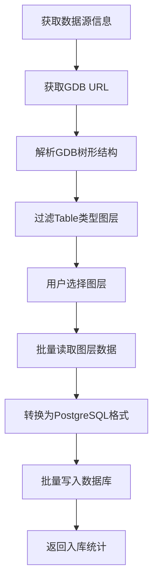

# GDB建库入库组件 - 完整实施方案

> **文档版本**: v1.0
> **创建时间**: 2025-12-17
> **更新时间**: 2025-12-17
> **状态**: ✅ 设计完成，待实施

---

## 📋 目录

1. [需求概述](#需求概述)
2. [组件设计](#组件设计)
3. [技术架构](#技术架构)
4. [数据模型](#数据模型)
5. [实施计划](#实施计划)
6. [接口定义](#接口定义)

---

## 需求概述

### 业务背景

在空间数据治理场景中，需要支持 **GDB（File Geodatabase）** 数据的建库和入库操作：

1. **GDB建库** - 将 GDB 文件注册到数据治理系统，建立元数据索引
2. **GDB入库** - 将 GDB 中的图层数据导入到 PostgreSQL+PostGIS 数据库

### 功能需求

| 组件名称 | 功能描述 | 输入 | 输出 |
|---------|---------|------|------|
| **GDB建库** | 调用 data-governance 服务建立 GDB 元数据 | GDB 文件 URL、资源库参数 | 建库结果信息 |
| **GDB入库** | 将 GDB 表数据导入 PostgreSQL | 数据源ID、GDB URL、资源库参数、图层选择 | 入库结果统计 |

### 核心特性

- ✅ 支持文件选择和变量引用两种方式
- ✅ 集成 datasense 数据源管理
- ✅ 支持图层选择和批量入库
- ✅ 支持 PostgreSQL + PostGIS 空间数据存储
- ✅ 完整的中英文国际化支持
- ✅ 详细的状态反馈和错误处理

---

## 组件设计

### 1. GDB建库组件（GDBCreateComponent）

#### 组件元数据

```python
display_name = "GDB建库"
description = "将GDB文件注册到数据治理系统，建立元数据索引"
icon = "Database"
name = "GDBCreate"
category = "spatial"
```

#### 输入参数

| 参数名 | 类型 | 必填 | 说明 |
|-------|------|------|------|
| `file_path` | FileInput | 否 | GDB 压缩包文件选择（.gdb.zip） |
| `file_id_variable` | StrInput | 否 | 文件变量（支持 `{gdbFileId}` 格式） |
| `repository_id` | StrInput | 是 | 资源库 ID |
| `gdb_name` | StrInput | 否 | GDB 名称（可选，自动从文件名提取） |

**注意**: `file_path` 和 `file_id_variable` 二选一必填。

#### 输出

| 输出名 | 类型 | 说明 |
|-------|------|------|
| `result` | Data | 建库结果信息（包含 GDB ID、名称、图层数量等） |

#### 工作流程


#### Feign 接口调用

**服务名**: `data-governance`

**接口路径**: `/api/v1/gdb/create` (假设)

**请求参数**:
```json
{
  "gdb_url": "https://minio.../file.gdb.zip",
  "repository_id": "repo_123",
  "gdb_name": "FDMGENT1021",
  "metadata": {
    "total_layers": 183,
    "total_datasets": 4,
    "file_size": 25600000
  }
}
```

**响应格式**:
```json
{
  "success": true,
  "code": 200,
  "msg": "建库成功",
  "data": {
    "gdb_id": "gdb_uuid_123",
    "name": "FDMGENT1021",
    "repository_id": "repo_123",
    "created_at": "2025-12-17T10:30:00Z"
  }
}
```

---

### 2. GDB入库组件（GDBImportComponent）

#### 组件元数据

```python
display_name = "GDB入库"
description = "将GDB表数据导入到PostgreSQL+PostGIS数据库"
icon = "Download"
name = "GDBImport"
category = "spatial"
```

#### 输入参数

| 参数名 | 类型 | 必填 | 说明 |
|-------|------|------|------|
| `datasource_id` | DropdownInput | 是 | 目标数据源（从 data-construction 获取） |
| `file_id_variable` | StrInput | 否 | GDB 文件变量 |
| `gdb_url` | StrInput | 否 | GDB 文件 URL（直接输入） |
| `repository_id` | StrInput | 是 | 资源库 ID |
| `layer_selection` | TableInput | 是 | 图层选择和配置 |
| `batch_size` | IntInput | 否 | 批量写入大小（默认 1000） |

**注意**: `file_id_variable` 和 `gdb_url` 二选一必填。

#### TableInput 配置（layer_selection）

| 列名 | 类型 | 说明 |
|------|------|------|
| `layer_name` | str | 图层名称 |
| `target_table_name` | str | 目标表名（可编辑，默认同 layer_name） |
| `import_enabled` | bool | 是否导入（勾选框） |
| `feature_count` | int | 要素数量（只读） |

**操作按钮**:
- 🔄 **加载图层列表** - 从 GDB URL 解析并填充表格

#### 输出

| 输出名 | 类型 | 说明 |
|-------|------|------|
| `result` | Data | 入库结果统计（成功/失败数量、详细信息） |

#### 工作流程



#### 数据转换逻辑

**GDB 字段类型 → PostgreSQL 类型映射**:

| GDB 类型 | PostgreSQL 类型 | 说明 |
|----------|----------------|------|
| `OID` | `SERIAL` | 自增主键 |
| `String` | `VARCHAR(n)` | 字符串，n 为 width |
| `Integer` | `INTEGER` | 整数 |
| `Double` | `DOUBLE PRECISION` | 浮点数 |
| `DateTime` | `TIMESTAMP` | 日期时间 |
| `Geometry` (WKT) | `GEOMETRY` | PostGIS 几何类型 |

**数据写入流程**:

1. 动态创建表结构（如果不存在）
2. 批量插入数据（batch_size 条/批次）
3. 创建空间索引（针对几何列）
4. 返回入库统计信息

---

## 技术架构

### 系统架构图

```
┌─────────────────────────────────────────────┐
│         Langflow 前端界面                    │
│   ┌──────────────┐    ┌──────────────┐      │
│   │  GDB建库组件  │    │  GDB入库组件  │      │
│   └──────┬───────┘    └──────┬───────┘      │
└──────────┼────────────────────┼─────────────┘
           │                    │
           ▼                    ▼
┌─────────────────────────────────────────────┐
│         Langflow 后端 (FastAPI)              │
│   ┌──────────────────────────────────┐      │
│   │   GDB Service (LFX层)             │      │
│   │   - parse_gdb_from_url()         │      │
│   │   - read_layer_data()            │      │
│   └──────────────────────────────────┘      │
└──────────┬────────────────────┬─────────────┘
           │                    │
           ▼                    ▼
┌──────────────────┐  ┌──────────────────────┐
│  Data Governance │  │  Data Construction   │
│  微服务           │  │  微服务               │
│  - GDB建库接口    │  │  - 数据源管理         │
│  - 元数据管理     │  │  - 文件服务           │
└──────────────────┘  └──────────────────────┘
           │                    │
           ▼                    ▼
┌─────────────────────────────────────────────┐
│         PostgreSQL + PostGIS                 │
│   - GDB元数据表                              │
│   - 空间数据表                               │
└─────────────────────────────────────────────┘
```

### 依赖服务

| 服务名 | 用途 | 接口示例 |
|-------|------|---------|
| **data-governance** | GDB建库、元数据管理 | `/api/v1/gdb/create` |
| **data-construction** | 数据源管理、文件服务 | `/api/v1/datasource/list`<br>`/api/v1/datasource/{id}` |
| **Langflow GDB Service** | GDB 解析、数据读取 | `/gdb/parse-from-url`<br>`/gdb/layer-data-from-url` |

### Feign 客户端设计

#### 1. DataGovernanceFeignClient

**文件路径**: `src/lfx/src/lfx/services/feign/clients/data_governance.py`

```python
class DataGovernanceFeignClient:
    """Data governance service Feign client."""

    SERVICE_NAME = "data-governance"

    async def create_gdb(
        self,
        gdb_url: str,
        repository_id: str,
        gdb_name: str | None = None,
        metadata: dict | None = None,
    ) -> dict:
        """Create GDB in data governance system."""

    async def import_gdb_layer(
        self,
        datasource_id: int,
        repository_id: str,
        layer_data: dict,
        target_table_name: str,
    ) -> dict:
        """Import GDB layer to database."""
```

#### 2. DataConstructionFeignClient (扩展)

已存在，需要确认以下方法可用：
- ✅ `get_datasource_list()` - 获取数据源列表
- ✅ `get_datasource_detail(datasource_id)` - 获取数据源详情
- ✅ `download_file(file_id)` - 下载文件

---

## 数据模型

### GDB建库结果模型

```python
class GDBCreateResult(BaseModel):
    """GDB 建库结果"""
    gdb_id: str                    # GDB 唯一标识
    name: str                      # GDB 名称
    repository_id: str             # 资源库 ID
    total_layers: int              # 总图层数
    total_datasets: int            # 总数据集数
    file_size: int                 # 文件大小（字节）
    created_at: datetime           # 创建时间
```

### GDB入库结果模型

```python
class GDBImportResult(BaseModel):
    """GDB 入库结果"""
    total_layers: int              # 总处理图层数
    success_count: int             # 成功入库数量
    failed_count: int              # 失败数量
    details: list[LayerImportDetail]  # 详细信息

class LayerImportDetail(BaseModel):
    """图层入库详情"""
    layer_name: str                # 图层名称
    target_table_name: str         # 目标表名
    feature_count: int             # 要素数量
    status: str                    # 状态（success/failed）
    error_message: str | None      # 错误信息（如有）
    duration_seconds: float        # 耗时（秒）
```

### 图层选择表结构

```python
class LayerSelectionRow(BaseModel):
    """图层选择表行"""
    layer_name: str                # 图层名称
    target_table_name: str         # 目标表名
    import_enabled: bool           # 是否导入
    feature_count: int             # 要素数量
```

---

## 实施计划

### 开发任务列表

#### Phase 1: 基础设施（1-2天）

- [ ] **Task 1.1**: 创建 DataGovernanceFeignClient
  - 文件: `src/lfx/src/lfx/services/feign/clients/data_governance.py`
  - 方法: `create_gdb()`, `import_gdb_layer()`

- [ ] **Task 1.2**: 在 deps.py 添加便利函数
  - 函数: `get_data_governance_client()`

- [ ] **Task 1.3**: 创建翻译文件
  - 英文: `src/lfx/src/lfx/locale/translations/en/components/spatial/gdb_create.json`
  - 中文: `src/lfx/src/lfx/locale/translations/zh/components/spatial/gdb_create.json`
  - 英文: `src/lfx/src/lfx/locale/translations/en/components/spatial/gdb_import.json`
  - 中文: `src/lfx/src/lfx/locale/translations/zh/components/spatial/gdb_import.json`

#### Phase 2: GDB建库组件（1-2天）

- [ ] **Task 2.1**: 创建 GDBCreateComponent
  - 文件: `src/lfx/src/lfx/components/spatial/gdb_create.py`
  - 功能: 文件选择、URL解析、建库调用

- [ ] **Task 2.2**: 实现文件ID获取逻辑
  - 支持 file_path 和 file_id_variable 两种方式

- [ ] **Task 2.3**: 实现建库流程
  - 调用 GDB Service 解析
  - 调用 data-governance 建库接口

- [ ] **Task 2.4**: 错误处理和状态反馈

#### Phase 3: GDB入库组件（2-3天）

- [ ] **Task 3.1**: 创建 GDBImportComponent
  - 文件: `src/lfx/src/lfx/components/spatial/gdb_import.py`
  - 功能: 数据源选择、图层选择、数据导入

- [ ] **Task 3.2**: 实现动态数据源加载
  - 从 data-construction 获取数据源列表
  - DropdownInput 动态填充

- [ ] **Task 3.3**: 实现图层列表加载
  - TableInput 的 action_buttons 处理
  - 调用 parse-from-url 获取树形结构
  - 过滤 Table 类型节点

- [ ] **Task 3.4**: 实现数据导入逻辑
  - 表结构自动创建
  - 批量数据写入
  - 空间索引创建

- [ ] **Task 3.5**: 实现入库统计
  - 成功/失败计数
  - 详细信息记录

#### Phase 4: 集成测试（1天）

- [ ] **Task 4.1**: 更新 __init__.py
  - 添加新组件导出

- [ ] **Task 4.2**: 单元测试
  - GDBCreateComponent 测试
  - GDBImportComponent 测试

- [ ] **Task 4.3**: 集成测试
  - 完整流程测试
  - 边界情况测试

- [ ] **Task 4.4**: 文档更新
  - 组件使用说明
  - API 文档

### 时间估算

| 阶段 | 预计时间 | 依赖 |
|------|---------|------|
| Phase 1 | 1-2天 | 无 |
| Phase 2 | 1-2天 | Phase 1 |
| Phase 3 | 2-3天 | Phase 1 |
| Phase 4 | 1天 | Phase 2, 3 |
| **总计** | **5-8天** | - |

---

## 接口定义

### 1. data-governance 服务接口（待确认）

#### 创建GDB

**端点**: `POST /api/v1/gdb/create`

**请求体**:
```json
{
  "gdb_url": "https://minio.example.com/bucket/file.gdb.zip",
  "repository_id": "repo_123",
  "gdb_name": "FDMGENT1021",
  "metadata": {
    "total_layers": 183,
    "total_datasets": 4,
    "file_size": 25600000
  }
}
```

**响应**:
```json
{
  "success": true,
  "code": 200,
  "msg": "建库成功",
  "data": {
    "gdb_id": "gdb_uuid_123",
    "name": "FDMGENT1021",
    "repository_id": "repo_123",
    "total_layers": 183,
    "created_at": "2025-12-17T10:30:00Z"
  }
}
```

#### 导入GDB图层

**端点**: `POST /api/v1/gdb/import-layer`

**请求体**:
```json
{
  "datasource_id": 1,
  "repository_id": "repo_123",
  "target_table_name": "ce_fent_a_bld_2025",
  "layer_data": {
    "layer_name": "CE_FENT_A_BLD_2025",
    "fields": [...],
    "features": [...]
  }
}
```

**响应**:
```json
{
  "success": true,
  "code": 200,
  "msg": "导入成功",
  "data": {
    "table_name": "ce_fent_a_bld_2025",
    "rows_inserted": 29,
    "duration_seconds": 0.5
  }
}
```

### 2. data-construction 服务接口（已有）

#### 获取数据源列表

**端点**: `GET /api/v1/datasource/list`

**响应**:
```json
{
  "success": true,
  "data": [
    {
      "id": 1,
      "name": "PostgreSQL主库",
      "type": "postgresql",
      "host": "192.168.1.100",
      "port": 5432,
      "database": "datasense",
      "status": "active"
    }
  ]
}
```

#### 获取数据源详情

**端点**: `GET /api/v1/datasource/{id}`

**响应**:
```json
{
  "success": true,
  "data": {
    "id": 1,
    "name": "PostgreSQL主库",
    "type": "postgresql",
    "host": "192.168.1.100",
    "port": 5432,
    "database": "datasense",
    "username": "admin",
    "status": "active"
  }
}
```

---

## 关键技术点

### 1. 文件ID获取逻辑

```python
def _get_file_id(self) -> str:
    """获取文件ID（优先级：变量 > 文件选择）"""
    # 优先使用变量
    if hasattr(self, "file_id_variable") and self.file_id_variable:
        variable_value = self.file_id_variable.strip()
        if variable_value:
            resolved = self._resolve_variable_with_fallback(variable_value)
            return resolved

    # 回退到文件选择
    if hasattr(self, "file_path") and self.file_path:
        return self._extract_file_id_from_path(self.file_path)

    raise ValueError("未提供文件源")
```

### 2. 动态数据源加载

```python
async def update_build_config(self, build_config, field_value, field_name, action):
    """动态加载数据源列表"""
    if field_name == "datasource_id":
        # 获取数据源列表
        client = get_data_construction_client()
        datasources = await client.get_datasource_list()

        # 过滤 PostgreSQL 类型
        pg_datasources = [ds for ds in datasources if ds["type"] == "postgresql"]

        # 更新 dropdown options
        build_config["datasource_id"]["options"] = [ds["id"] for ds in pg_datasources]
        build_config["datasource_id"]["options_metadata"] = [
            {"value": ds["id"], "label": f"{ds['name']} ({ds['host']})"}
            for ds in pg_datasources
        ]
```

### 3. 图层列表动态加载

```python
async def update_build_config(self, build_config, field_value, field_name, action):
    """加载图层列表按钮"""
    if field_name == "layer_selection" and action == "load_layers":
        # 获取 GDB URL
        gdb_url = await self._get_gdb_url()

        # 解析树形结构
        tree_structure = await gdb_service.parse_gdb_from_url(gdb_url)

        # 过滤 Table 类型图层
        table_layers = self._filter_table_layers(tree_structure.root)

        # 填充表格
        build_config["layer_selection"]["value"] = [
            {
                "layer_name": layer.name,
                "target_table_name": layer.name.lower(),
                "import_enabled": True,
                "feature_count": layer.feature_count,
            }
            for layer in table_layers
        ]
```

### 4. 批量数据写入

```python
async def _import_layer(self, layer_config: dict, datasource_info: dict):
    """导入单个图层"""
    # 1. 读取图层数据
    layer_data = await gdb_service.read_layer_data_from_url(
        self.gdb_url,
        layer_config["layer_name"]
    )

    # 2. 创建表结构
    await self._create_table_if_not_exists(
        datasource_info,
        layer_config["target_table_name"],
        layer_data.fields
    )

    # 3. 批量插入数据
    for i in range(0, len(layer_data.features), self.batch_size):
        batch = layer_data.features[i:i + self.batch_size]
        await self._insert_batch(
            datasource_info,
            layer_config["target_table_name"],
            batch
        )

    # 4. 创建空间索引（如果有几何列）
    await self._create_spatial_index(
        datasource_info,
        layer_config["target_table_name"]
    )
```

---

## 风险与注意事项

### 技术风险

| 风险项 | 影响 | 缓解措施 |
|-------|------|---------|
| data-governance 接口未实现 | 🔴 高 | 提前与后端团队确认接口规范 |
| GDB 文件过大导致超时 | 🟡 中 | 增加超时时间，实现进度反馈 |
| PostgreSQL 连接失败 | 🟡 中 | 完善错误处理，提供重试机制 |
| 字段类型映射不完整 | 🟢 低 | 覆盖常见类型，未知类型降级为 TEXT |

### 性能优化

- ✅ 批量写入（batch_size=1000）
- ✅ 使用 COPY 命令替代 INSERT（如可能）
- ✅ 异步处理多个图层（并发导入）
- ✅ 空间索引延迟创建（数据导入后）

### 安全考虑

- ✅ 数据源密码不在日志中显示
- ✅ SQL 注入防护（使用参数化查询）
- ✅ 文件 URL 验证（防止 SSRF）

---

## 附录

### A. 现有 GDB API 响应示例

参考文件: `d:\corporation\imagtel\awesome-programmer\gfkd-ds\langflow\新建 文本文档.json`

**树形结构示例**:
```json
{
    "gdb_name": "FDMGENT1021",
    "total_layers": 183,
    "total_datasets": 4,
    "root": {
        "name": "FDMGENT1021",
        "node_type": "root",
        "children": [
            {
                "name": "CE_FENT_A_BLD_2025",
                "node_type": "table",
                "feature_count": 29,
                "geometry_type": "None",
                "data": {
                    "layer_name": "CE_FENT_A_BLD_2025",
                    "fields": [...],
                    "features": [...]
                }
            }
        ]
    }
}
```

### B. 参考组件

- **GeoJSONInputComponent** - 文件输入和变量解析模式
- **SpatialTransformComponent** - TableInput 的 action_buttons 使用
- **DataMaskingComponent** - DropdownInput 动态加载

### C. 测试用例

#### GDB建库测试

```python
async def test_gdb_create_component():
    component = GDBCreateComponent(
        file_id_variable="{gdbFileId}",
        repository_id="repo_123",
    )
    result = await component.create_gdb()
    assert result["gdb_id"] is not None
```

#### GDB入库测试

```python
async def test_gdb_import_component():
    component = GDBImportComponent(
        datasource_id=1,
        gdb_url="https://minio.../file.gdb.zip",
        repository_id="repo_123",
        layer_selection=[
            {
                "layer_name": "CE_FENT_A_BLD_2025",
                "target_table_name": "ce_fent_a_bld_2025",
                "import_enabled": True,
                "feature_count": 29,
            }
        ],
        batch_size=1000,
    )
    result = await component.import_layers()
    assert result["success_count"] > 0
```

---

**文档结束**
